# ProductManager

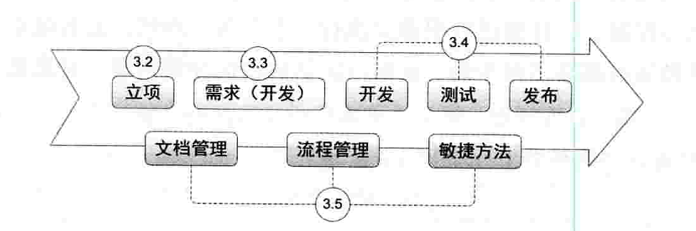

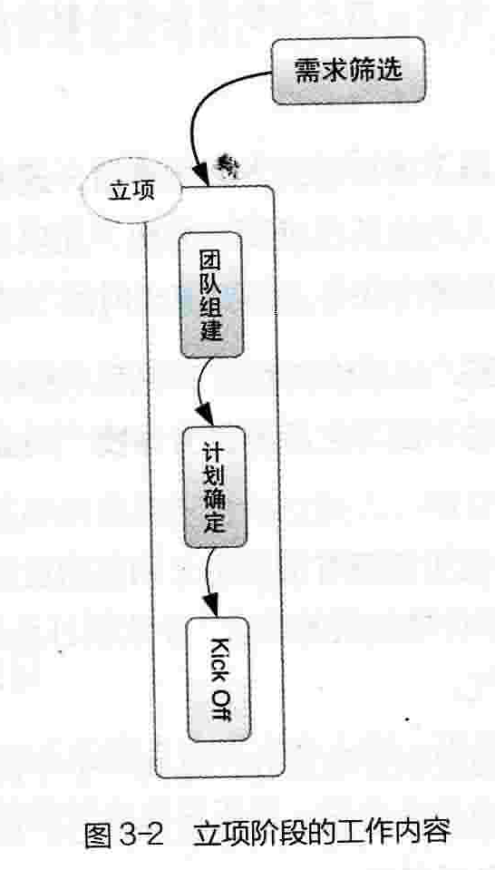

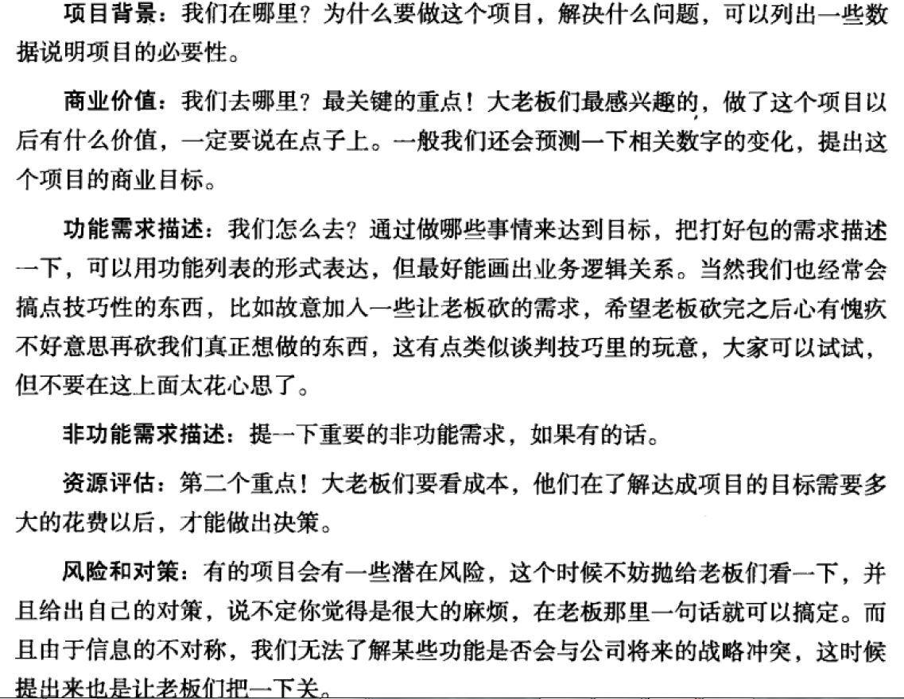

##架构

###画业务架构
对照业务流程，根据自己设想的产品机制、基本产品形态和用户的使用路径，列出需要的页面&功能&模块等前后端逻辑。 
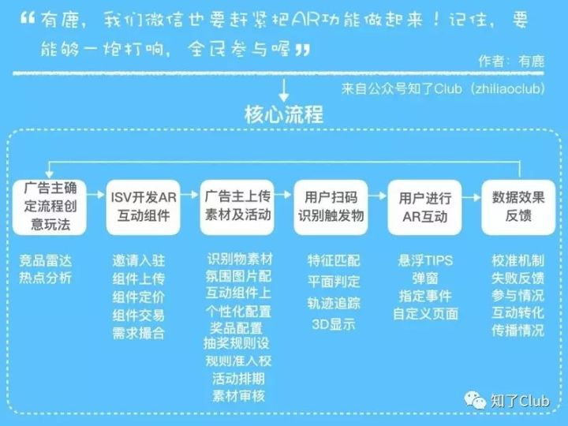

###业务架构师（与产品经理的职能有部分重叠）和技术架构师
架构师区分为技术架构师和业务架构师两种，前者顾名思义是偏向于技术的选型，做到架构的合理性，后者更多的是偏向业务的架构，组织合理的业务结构，很多业务架构师从产品经理中转化而来，所以这类人和产品经理的工作职责区别不大，只是管理更多的产品线而已。

###产品架构和业务架构
前者侧重一个产品或产品组合内的模块划分、功能边界和整体协同，后者侧重某个具体场景下端到端的业务流程，以及此流程内涉及产品的数据流向、交互和集成关系。
**<u>J我的理解是有时候两者都是不触及技术的，但定位不一样，产品架构是分类（偏向产品中的使用路径等），业务架构是端到端（比如某个具体功能）。</u>**

#### 典型的几个产品架构模型

Jesse James Garrett在《用户体验要素》这本书中，为我们系统阐述了互联网产品的几个典型的产品信息架构模型。第一种信息架构模型比较符合我们产品经理对产品架构的理解和定位，后面三种信息架构模型，你可以当作是第一种模型的补充，或者你也可以把它当作页面级别的信息架构梳理。

##### 第一种：层级结构（hierarchical structure）

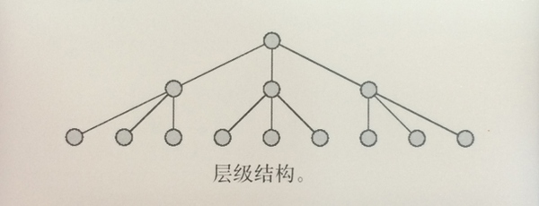

层级结构模型

书中原文是这么来描述这种产品架构：

> 在层级结构中，节点与其他相关节点之间存在父级/子级的关系。子节点代表着更狭义的概念，从属于代表着更广义类别的父节点。不是每个节点都有子节点，但是每个节点都有一个父节点，一直往上直到整个结构的父节点。层级关系的概念对于用户来说非常容易理解，同时软件也是倾向于层级的工作方式，因此这种类型的结构是最常见的。

这种伞状式的产品架构，恐怕是互联网、移动互联网产品中使用最多的一种信息结构，比如我们使用频度最高的微信、手q，以及各类to c 的移动APP，甚至是复杂的to b 类产品，都是使用这种产品架构进行产品设计。这种架构的特点是符合人类的认知习惯，因为人类天生就有分类的习惯。

比如书桌，我们会习惯把书籍放在一起，把录音卡带等放到一边；又比如我们的衣柜，我们一半会将不同季节的衣服放在不同的位置。在生活中，整理物品是为了更容易地找到自己需要的东西。

下图是蜻蜓fm早期版本的一个层级信息架构：

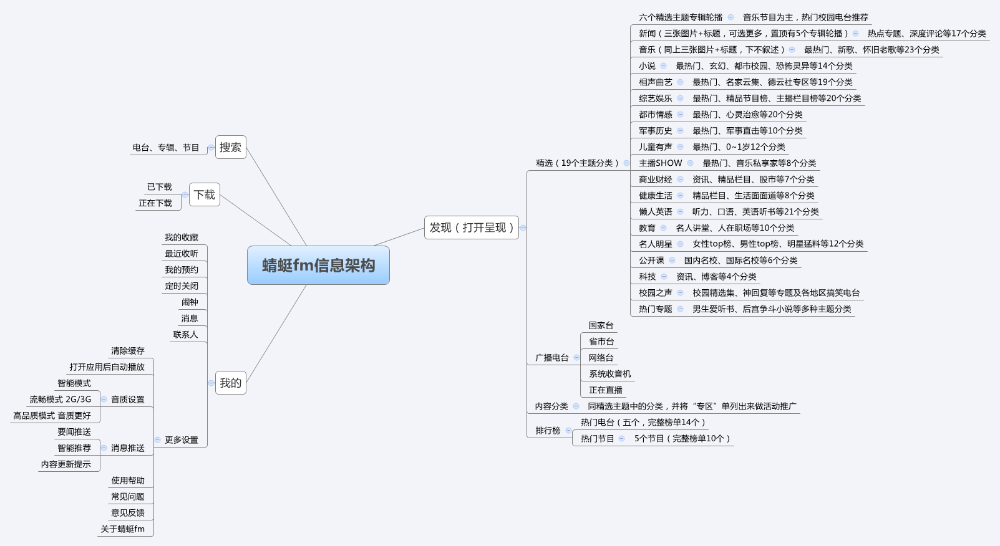

在使用层级结构的时候，需要注意层级的深浅和宽窄这个问题。

大家都有过逛商场的经验，其实有时候做产品和逛商场很相似，有的商场设计的比较合理，很容易能够让自己找到想要的商品品类，有的商场设计却经常让你迷路。

在确定产品架构的时候，考虑产品架构的深度和广度成为了产品经理的一道必选题，就拿淘宝APP和唯品会APP来说，淘宝属于广而深的架构，唯品会则属于浅而窄的架构（相对）。

在偏深度的架构中，用户操作起来效率不高，用户获取信息、完成目标任务的路径增多，但是相对而言，减少了用户选择的入口。在偏广度的架构中，用户面对的入口增多，在选择入口的时候比较费时，但是减少了用户的操作路径。

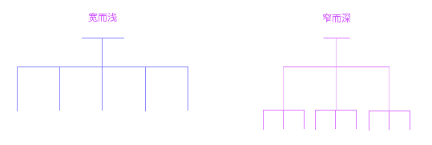

宽而浅的产品架构和窄而深的产品架构，各有优势和劣势，具体使用哪一种产品架构，关键是要结合自身产品的定位、业务特性和用户特征及使用场景来进行取舍和判断。

##### 第二种：自然结构（organic structures）

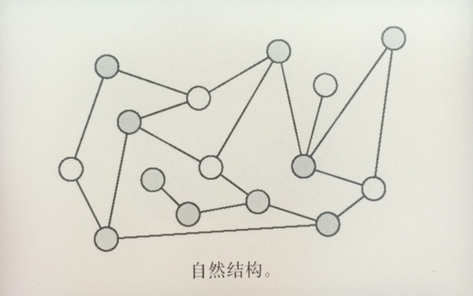

自然结构模型

原文描述如下：

> 自然结构不会遵循任何一致的模式。节点是逐一被连接起来的，同时这种结构没有太强烈的分类概念。自然结构对于探索一系列关系不明确或一直在演变的主题是很合适的。但是自然结构没有给用户提供一个清晰的指示，从而让用户能感觉他们在结构中的哪个部分。
>
>  
>
> 如果你想要鼓励自由探险的感觉，比如某些娱乐或教育网站，那自然结构可能会是个好的选择；但是，如果你的用户下次还需要依靠同样的路径，去找到同样的内容，那么这种结构就可能会把用户的经历变成一次挑战。

事实上，这种形态的产品架构一般在to  c 的游戏、娱乐、资讯产品里面运用的比较广泛，例如优酷视频、好奇心日报等。当然，很多时候自然结构是应该结合层级结构来进行思考的。

比如用户进入好奇心日报这个网站，可能的一种使用方式是，用户心里已经有一个明确的资讯目标，想看一下最近商业有发什么大故事，所以用户会点击上方的“全部分类”，选择电影，选择商业板块然后进行浏览。也有另一种使用方式，就是毫无目标，直接就是这么从上到下浏览下去，看到自己感兴趣的文章标题便点击进去。

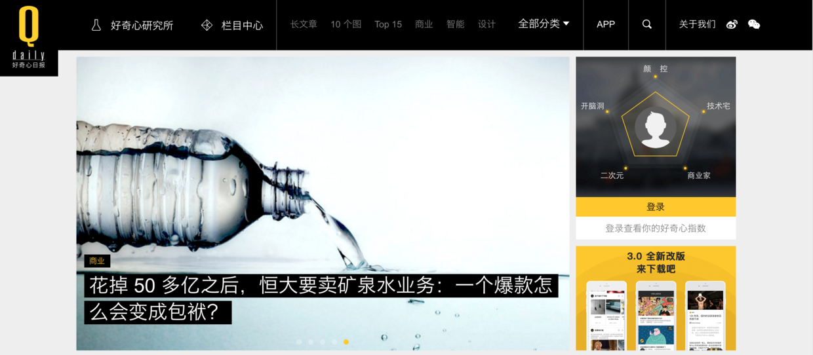

自然结构很适合轻架构产品的浏览式形式，尤其比较适合to  c 类的娱乐休闲类产品，因为这类产品的目标用户，绝大多数时候的使用场景都是无聊式地浏览，并没有明确的用户目标，也不需要解决什么特定的任务。

##### 第三种：线性结构（sequential structures）

依旧来看下原文描述：

> 线性结构来自于你最熟悉的线下媒体。连贯的语言流程是最基本的信息结构类型，而且处理它的装置早已被深深地植入我们的大脑中了。书、文章、音像和录像全部都被设计成一种线性的体验。
>
>  
>
> 在互联网中线性结构经常被用于小规模的结构，例如单篇的文章或单个专题；大规模的线性结构则被用于限制那些需要呈现的内容顺序对于符合用户需求非常关键的应用程序，比如教学资料。

说的直白一点，所谓线性结构，就是你用一个讲述故事的方式去给用户介绍你的产品，多见于产品专题页、帮助文档的设计。其实这部分也没什么可讲的，关键是讲述故事或者问题的时候，你的思路是否清晰，很多时候这部分工作也会由运营的同事替我们代劳。

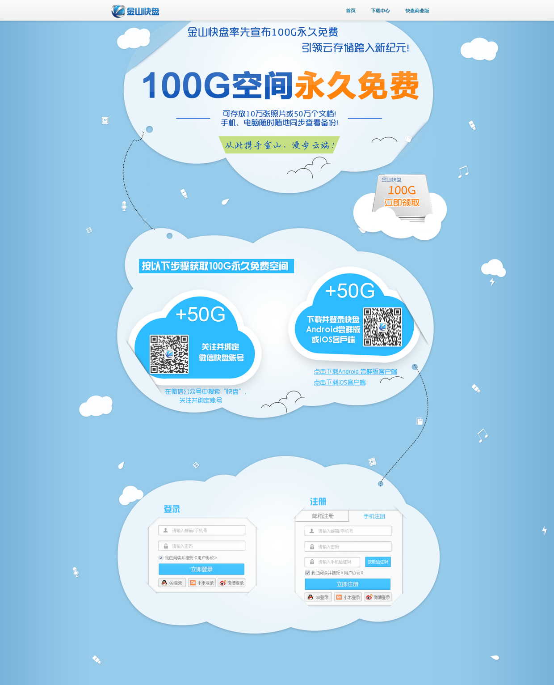

##### 第四种：矩阵结构（matrix structure）

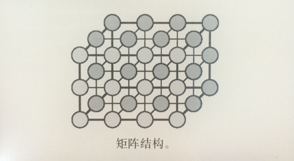

矩阵结构模型

书中是这么描述矩阵结构的：

> 矩阵结构允许用户在节点与节点之间沿着两个或更多的“维度”移动。由于每一个用户的需求都可以和矩阵中的一个“轴”联系在一起，因此矩阵结构通常能帮助那些“带着不同需求而来”的用户，使他们能在相同内容中寻找各自想要的东西。举个例子来说，如果你的某些用户确实很想通过颜色来浏览产品，而其他人偏偏希望能通过产品的尺寸来浏览，那么矩阵结构就可以同时容纳这两种不同的用户。
>
>  
>
> 然而，如果你期望用户把这个当成主要的导航工具，那么超过三个维度的矩阵可能就会出现问题。在四个或更多维度的空间下，人脑基本上不可能很好地可视化这些移动。

看了上面这段话，你的第一反应是不是想到了下面这个产品设计界面：

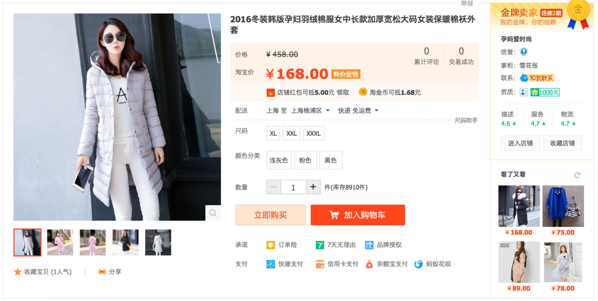

矩阵式的信息结构，需要将多种信息内容放置在一个页面里，所以它的重点和难点是在于如何做好信息分层，让信息更加有效率地传达给自己的目标用户，这个问题我们放在后面来讲。

###业务架构-应用架构-数据架构-技术架构

**业务（逻辑）架构**：**<u>使用一套方法论对产品（项目）所涉及到的需求的业务进行业务边界划分，简单的讲就是根据一套逻辑思路进行业务的拆分</u>**，总体原则是对业务进行业务边界的划分，比如做一个企业订购服务网站，你需要把商品类目、商品、订单、订单服务、支付、退款很清晰的划分出来，而**<u>业务架构不需要考虑诸如我用什么技术开发、我的并发大怎么办、我选择什么样的硬件等等</u>**。

**应用架构**：应用是介于业务语言与技术语言之间，是对整个系统实现的总体上的架构，他需要指出系统的层次、系统开发的原则、系统各个层次的应用服务，例如，上述系统中可以分为、**<u>数据层（资源层）、数据服务层、中间构建服务层、业务逻辑层、表现层，并写明每个层次应用服务</u>**。
另一个例子就是：工具层/功能层/框架层/应用层。
工具层：按钮等。
功能层：按钮等的组合。
框架层：构成个页面。
应用层：代表产品。
**<u>J我的理解就是这个应用架构有分层的思想，需要更多的细节（很多时候都是讲这个）。</u>**
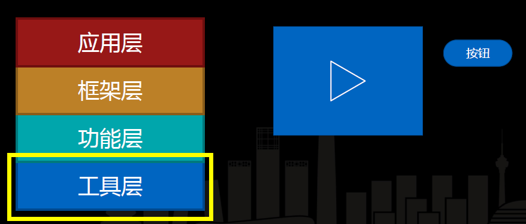
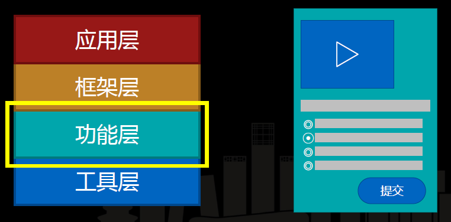
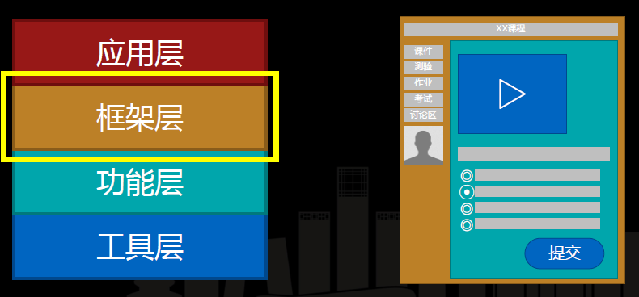
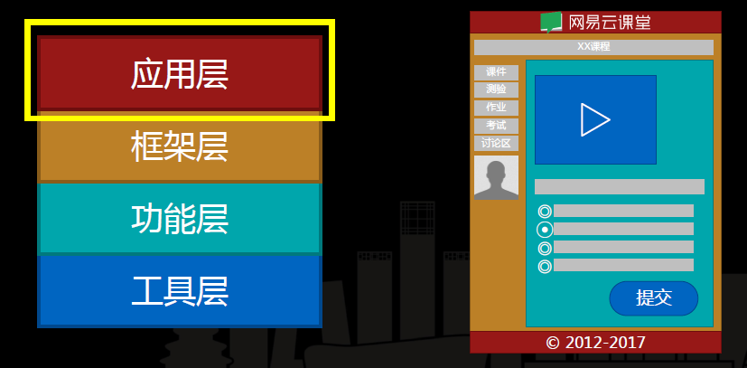

**数据（持久化）架构**：**<u>对存储数据（资源）的架构方法论</u>**，其架构原则同应用架构大同小异，即考虑到各个系统应用场景、不同时间段的应用场景对数据进行诸如数据异构、读写分离、数据库或NOSQL的策略、缓存的使用、分布式数据（数据库）策略等等。

**技术架构**：我的理解是对<u>**上述架构中提出的功能（或服务）进行技术方案的实现**</u>。包括软件系统实现、操作系统选择、运行时设计。技术架构设计面较广，专业性较强。

###技术架构资料
《大型网站技术架构\_核心原理与案例分析\_李智慧》
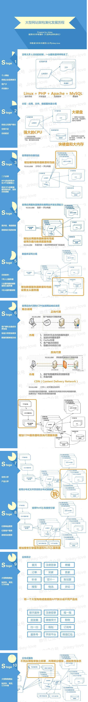

## 产品经理

### 互联网思维

- 快（J即高发展速度）
- 流量获取，对比于传统的渠道
- 流量变现，而非传统的卖产品

### BRD(商业需求文档)-过会

介绍，为什么做，怎么做，需要资源，产生的效益，风险

#### 商业模式画布-产生的效益

如何赚钱

#### 竞品分析-为什么做

SWOT

#### 市场分析-为什么做

市场价值多大，多少公司在做，盈亏情况，发展潜力

J技术去实现。

#### 产品路线图-怎么做

| 总目标 | 内容                        |
| ------ | --------------------------- |
| 目标1  | 下个月用户增加10000人       |
| 目标2  | 下个季度文章阅读量达到2000+ |

具体清单

| 清单内容                         | 优先级 | 启动时间 |
| -------------------------------- | ------ | -------- |
| 增加分享获得积分功能             | 5      | now      |
| 线下推广增加投放量               | 5      | now      |
| 文章及时更新                     | 4      | 7月20号  |
| 定期做访谈，关注用户最关心的知识 | 2      | 9月初    |

### MRD(市场需求文档)-研究用户

同上再加一个用户画像

#### 用户画像-研究市场

访谈，可以挖的很深，就像写故事分析人物一样。

J技术实现。

### PRD(产品需求文档)-面向组员开展工作

| 流程图     | 作用                                                         |
| ---------- | ------------------------------------------------------------ |
| 业务流程图 | 不同模块放在各个泳道中并以带箭头的线去跨泳道指出逻辑关系**（J由此可知只需知后端记录何，返回何即可，无需关心实现细节**） |
| 任务流程图 | 用户角度，模拟用户达到目的的所有流程                         |
| 页面流程图 | 对象是页面（J类似任务流程图，偏向于页面）                    |

#### 测试用例图

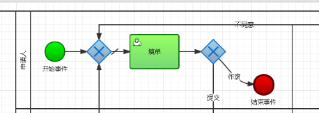

| 功能模块 | 测试点编号 | 测试点描述                         |
| -------- | ---------- | ---------------------------------- |
| 登录功能 | 1          | 正常登陆                           |
|          | 2          | 判断输入的手机号或邮箱是否符合规范 |
|          | 3          | 判断输入账号是否存在               |
|          | 4          | 输入账号为空时点击登录             |
|          | 5          | 输入密码为空时点击登录             |
|          | 6          | 输入密码错误时点击登录             |
|          | 7          | 输入账号密码都为空时点击登录       |
|          | 8          | 下次自动登录按钮是否有效           |
|          | 9          | 忘记密码按钮是否有效               |
|          | 10         | 第三方登录是否有效                 |
|          | 11         | 注册账号按钮是否有效               |

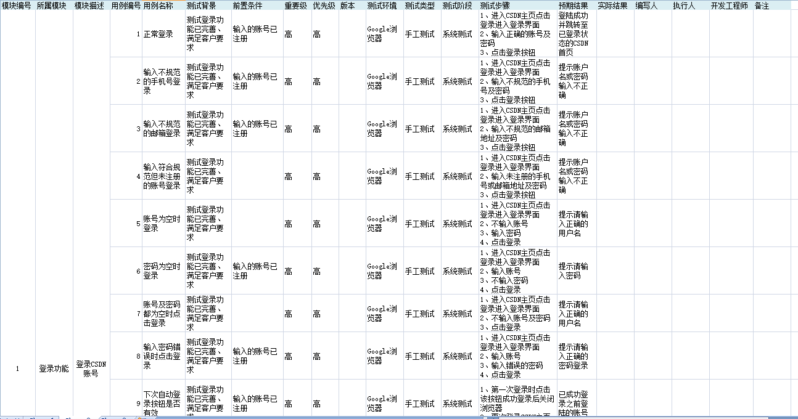

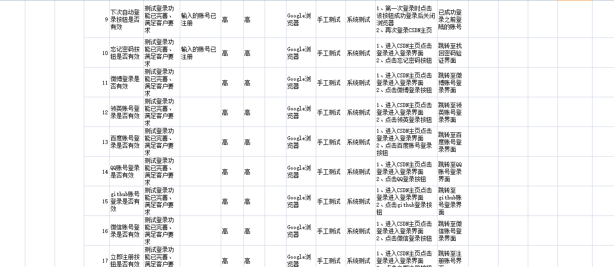

#### 业务流程图-多模块间泳道

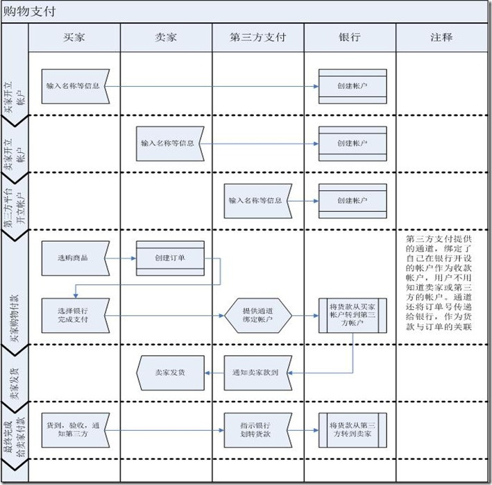

#### 任务流程图-面向用户

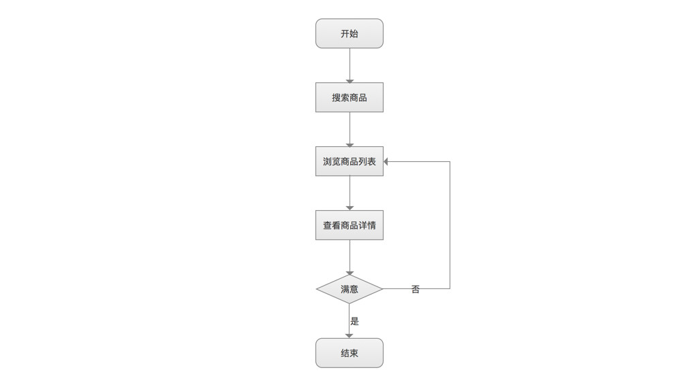

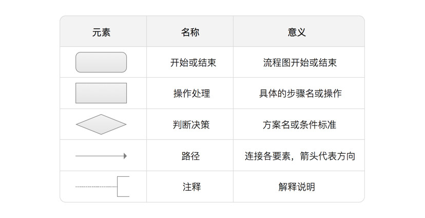

#### 页面流程图-基于页面

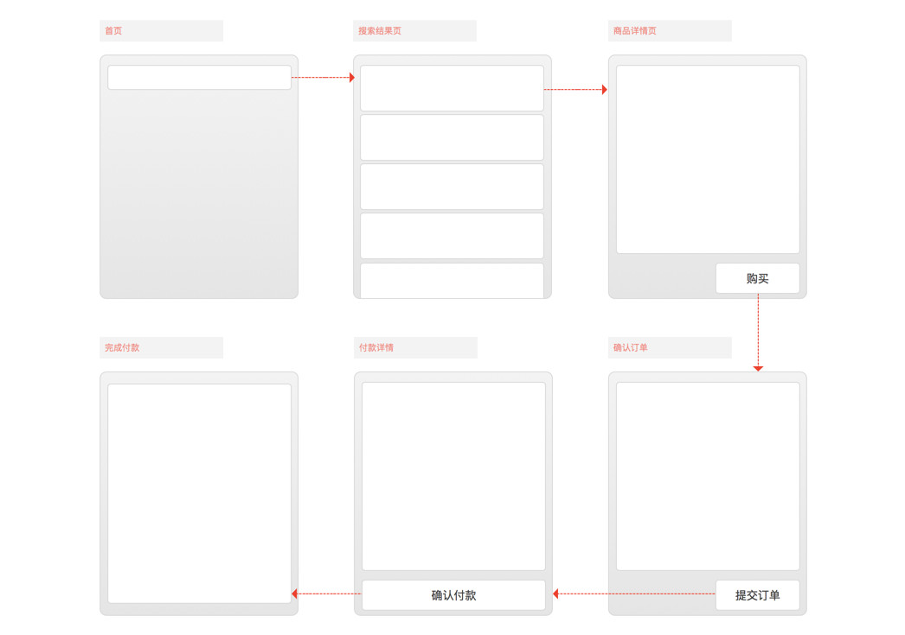

#### 原型-J理解为在上面三个图后再产出的原型

包含静态页面样式（线框图），也包含动态的操作效果。

#### 需求-即对PRD进行细讲

##### 需求来源

- 用户调查
- 用户反馈分析
- 产品数据分析
- 竞品分析

#####需求分类

- 功能类
- 数据类
- 运营类
- 体验类
- 设计类

#### 功能及清单

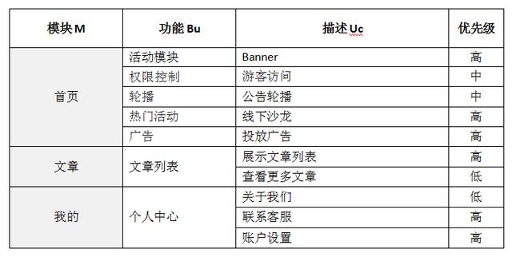

#### 考核指标

### 数据分析

### 上线清单

#### 测试流程

研发-测试-产品-UI/UE-运营

###PRD范例

## 相关资料

Useful_Docs_for_Product_Manager_by_iamsujie_V1.2

github上

人人都是产品经理

产品经理必读文档

大型网站技术架构

保存至mendely

##Reference

https://www.zhihu.com/question/28739159

http://www.woshipm.com/pd/428064.html

http://www.woshipm.com/pmd/431170.html

https://zhuanlan.zhihu.com/p/29400315

<https://blog.csdn.net/sdr_zd/article/details/70453027> 

<http://www.woshipm.com/pd/441557.html> 

<http://www.woshipm.com/rp/853599.html> 

